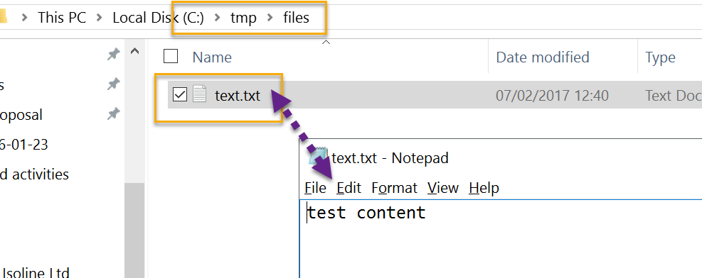
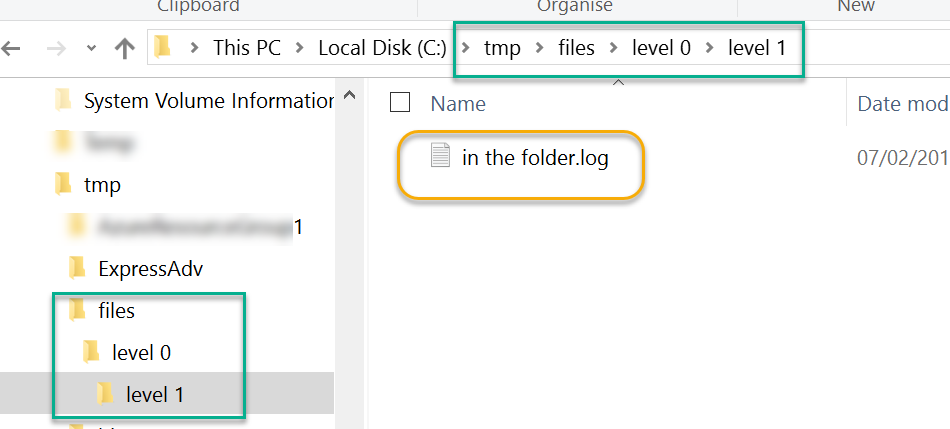

# Blob Storage

Blob Storage stores files. A file has only two properties - `ID` and raw data. If you build an analogy with disk filesystem, file ID is a file name.

Blob Storage is really simple abstraction - you read or write file data by it's ID, nothing else.

## Using

The entry point to a blog storage is `IBlobStorage` interface. This interface is small but contains all possible methods to work with blobs.

Usually you instantiate `IBlobStorage` with a specific instance implementing it, for instance Amazon S3 or Microsoft Azure Blob Storage, or even a local file system. The framework makes it trivial to create one.

Streaming is heavily utilised and all the interface methods always prefer streamed data.

All the storage implementations can be created either directly or using factory methods available in the `Storage.Net.StorageFactory.Blobs` class. More methods appear in that class as you reference an assembly containing specific implementations.

## Use Cases

These example use cases simulate some most common blob operations which should help you to get started.

### Save file to Azure Blob Storage and read it later

In this example we create a blob storage implementation which happens to be Microsoft Azure blob storage. The project is referencing an appropriate [nuget package](https://www.nuget.org/packages/Storage.Net.Microsoft.Azure/). As blob storage methods promote streaming we create a `MemoryStream` over a string for simplicity sake. In your case the actual stream can come from a variety of sources.

```csharp
using Storage.Net;
using Storage.Net.Blob;
using System.IO;
using System.Text;

namespace Scenario
{
   public class DocumentationScenarios
   {
      public void Run()
      {
         //create the storage using a factory method
         IBlobStorage storage = StorageFactory.Blobs.AzureBlobStorage(
            "storage key",
            "storage secret",
            "containername");

         //upload it
         string content = "test content";
         using (var s = new MemoryStream(Encoding.UTF8.GetBytes(content)))
         {
            storage.UploadFromStream("someid", s);
         }

         //read back
         using (var s = new MemoryStream())
         {
            storage.DownloadToStream("someid", s);

            //content is now "test content"
            content = Encoding.UTF8.GetString(s.ToArray());
         }
      }
   }
}
```

### Save file to a specific folder

This scenario demonstrates how to save files to a folder on local disk. Notice that we are still using `IBlobStorage` interface and don't really care where we are writing to. Here is how we create an instance of `IBlobStorage` which is mapped to `c:\tmp\files` folder:

```csharp
IBlobStorage storage = StorageFactory.Blobs.DirectoryFiles(new DirectoryInfo("c:\\tmp\\files"));
```

Now let's create a blob called `test.txt` with sample content and see what happened to that folder:

```csharp
string content = "test content";
using (var s = new MemoryStream(Encoding.UTF8.GetBytes(content)))
{
    storage.UploadFromStream("text.txt", s);
}

```

As you can see on disk a file was created with the same name as blob ID:



This is close, but not exactly what we want, right? I'd like to save it to a specific folder. There is no interface method though to specify the folder name. However, the disk implementation treats forward slashes as folder separators, therefore you can place a file in the folder if you name it like this: `level 0/level 1/in the folder.log`. For example:

```csharp
using (var s = new MemoryStream(Encoding.UTF8.GetBytes(content)))
{
    //using helper method to combine path parts, essentially this equals to 'level 0/level 1/in the folder.log'
    string subfolderBlobId = StoragePath.Combine("level 0", "level 1", "in the folder.log");

    storage.UploadFromStream(subfolderBlobId, s);
}
```

Looking back to folder contents:



Job done.

### List all files in a folder

There is no concept of folders in most of the blob storages, just a flat file structure. However, file names can contain folder separators, that's how they are virtually aligned into folders. This this example I'm going to upload three files to Amazon S3 storage - two files to one folder and another file to the second folder, and then list the contents of the first folder which will contain only two files.

```csharp
using Storage.Net;
using Storage.Net.Blob;
using System.IO;
using System.Text;

namespace Scenario
{
   public class DocumentationScenarios
   {
      public void Run()
      {
         //create the storage using a factory method
         IBlobStorage storage = StorageFactory.Blobs.AmazonS3BlobStorage(
            "aws_access_key_id",
            "aws_secret_access_key",
            "bucket_name");


         //upload three files
         //Generator is just a utility method to generate a random stream
         storage.UploadFromStream("folder1/file1", Generator.RandomString.ToMemoryStream());
         storage.UploadFromStream("folder1/file2", Generator.RandomString.ToMemoryStream());
         storage.UploadFromStream("folder2/file1", Generator.RandomString.ToMemoryStream());

         //list the contents of folder1
         string[] folderBlobs =storage.List("folder1").ToArray();
      }
   }
}
```

The last line of this code sample contains exactly two entries. Note that I've used the `List(prefix)` method which filters out anything not starting with a specific string.

### Copy files between different storage providers

This sample is useful if you want to transfer files between two storage providers like from Microsot Azure to Amazon S3 or vice versa. Or copy files from the local disk to one of the cloud providers, it doesn't matter as we are using the same interface. You can even build your own blob transfer utility which supports all of the cloud providers.

> todo

