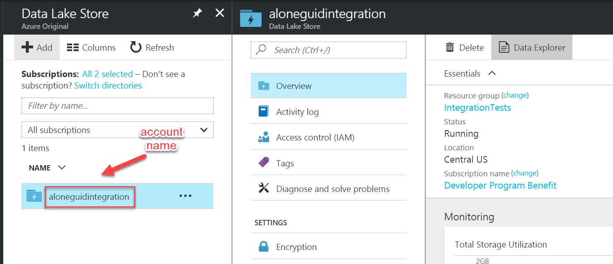
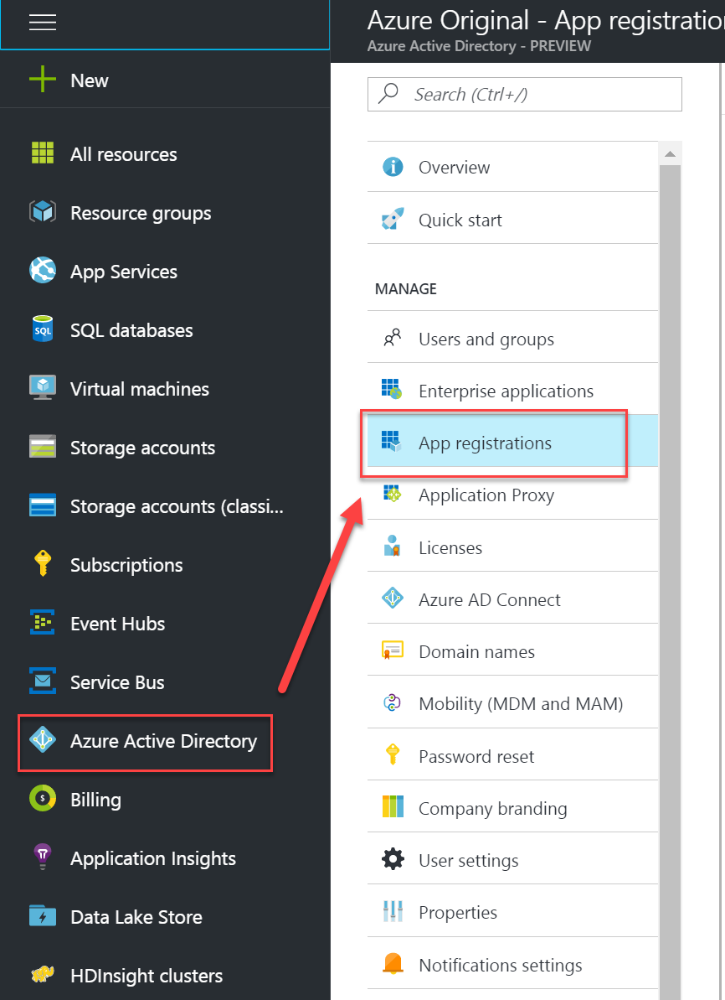
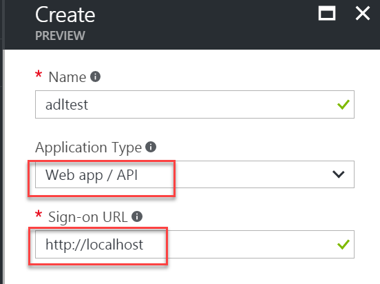
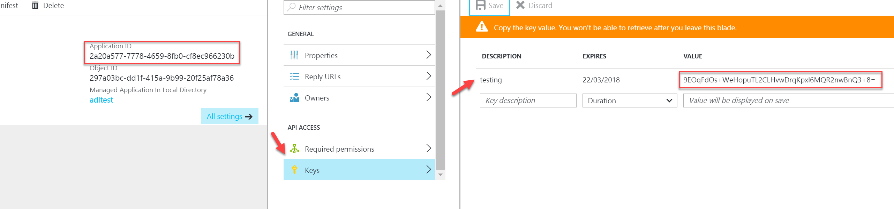
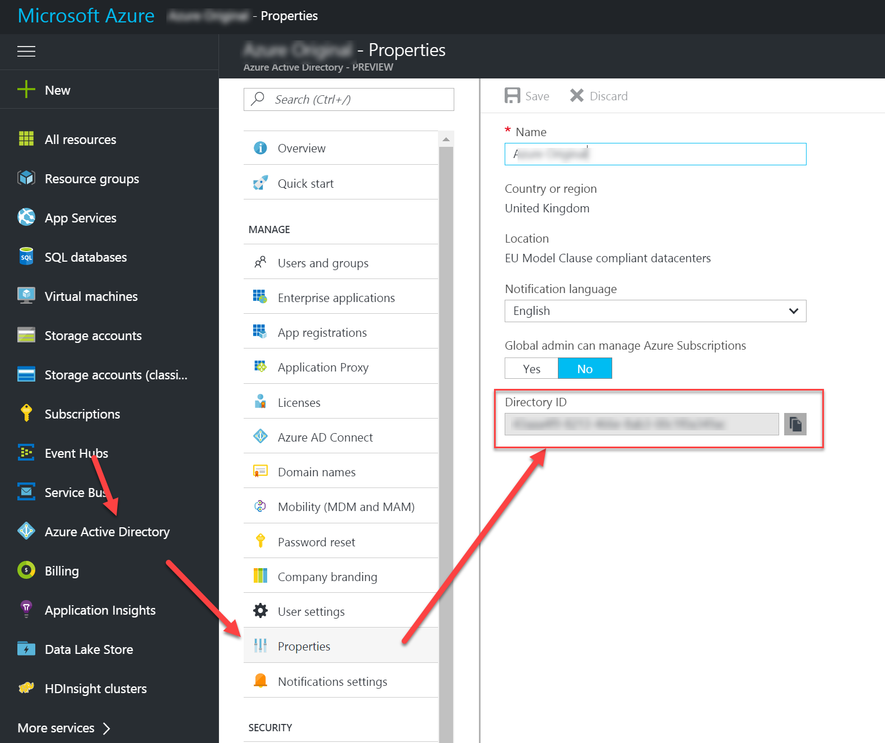

# Microsoft Azure Data Lake Store

Microsoft Azure implementations reside in a separate package hosted on [NuGet](https://www.nuget.org/packages/Storage.Net.Microsoft.Azure.DataLake.Store/). Follow the link for installation instructions.

This package tries to abstract access to [Azure Data Lake Store](https://azure.microsoft.com/en-gb/services/data-lake-store/) and making them available as `IBlobStorage`.

## Using

This library supports service-to-service authentication either with a **client secret** or a **client certificate** (not supported in preview yet).

To create an instance of the client:

```csharp
IBlobStorage storage = StorageFactory.Blobs.AzureDataLakeStoreByClientSecret(
	"account_name", credentials);
```

where:
- **Account name** is the name of the ADLS account as displayed in the portal: 
- **Credentials** is an instance of `NetworkCredential` class where:
  - **domain** is active directory __tenant id__
  - **username** is active directory principal's __client id__ (application id)
  - **password** is active directory principal's __secret__

see appendix below on how to obtain this information.

Alternatively, you can create the storage using connection string:

```csharp
// do not forget to initialise azure module before your application uses connection strings:
StorageFactory.Modules.UseAzureDataLakeStorage();

// create the storage
IBlobStorage storage = StorageFactory.Blobs.FromConnectionString("azure.datalakestore://accountName=...;tenantId=...;principalId=...;principalSecret=...");
```

### Important Implementation Notes

- Uploading a file always overwrites existing file if it exists, otherwise a new file is created. This still takes one network call.
- Appending to a file checks if a file exists first, so this operation results in two network calls.
- List operation supports folder hierary, folders, recursion, and limiting by number of items, i.e. no limitations whatsoever.


## Appendix. Creating a Service Principal

### For authentication using Client Secret

#### Create Active Directory Application

Go to **Active Directory / App registrations**:



Press **Add button**. Type any name for the application, but leave **Application Type** as **Web app / API** and set **sign-on url** to **`http://localhost`**:



Now open the application and create a new key. We need to write down this **key** and **Application ID**:



You can get the **tenant id** (sometimes called a **diretory id** or **domain**) from the directory properties:


