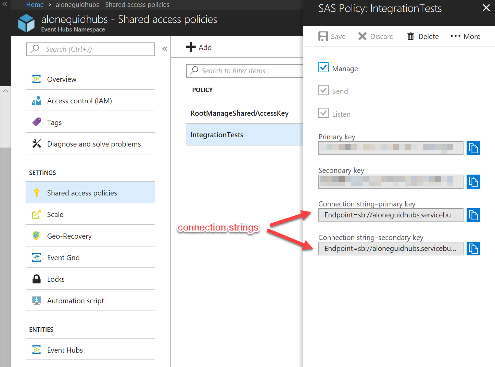
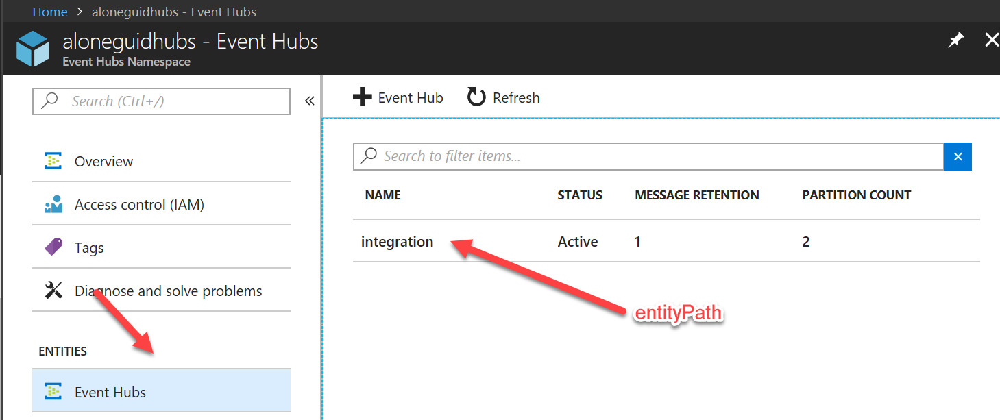

do not edit this, to be deleted

# Microsoft Azure Event Hub

Microsoft Azure implementations reside in a separate package [](https://www.nuget.org/packages/Storage.Net.Microsoft.Azure.EventHub)

This package tries to abstract access to [Azure Event Hubs](https://azure.microsoft.com/en-us/services/event-hubs/) and making them available as `IMessagePublisher` and `IMessageReceiver`.

## Using

### Publishing Messages

To publish a message first you need to create a publisher:

```csharp
IMessagePublisher publisher = StorageFactory.Messages.AzureEventHubPublisher(
                  connectionString,
                  entityPath);
```

The connection string specifies a connection string to **Event Hub Namespace** and not a specific entity. The entity is passed as a second parameter, which is shown on a screenshot below:






If you need another way to connect to Event Hubs, please raise an issue in this project.

### Receiving Messages

You can receive messages by creating an `IMessageReceiver` with the following factory method:

```csharp
IMessageReceiver receiver = StorageFactory.Messages.AzureEventHubReceiver(
                  connectionString,
                  entityPath,
                  patitionIds,
                  consumerGroupName,
                  stateStorage);
```

`connectionString` and `entityPath` should match the publisher parameters, the rest of them need an explanation:

- **partitionIds** is an *optional* parameter of `IEnumerable<string>` type and when specified creates a listener only for partition IDs passed. When ommitted, this receiver will listen on **all** partitions of Event Hub.
- **consumerGroupName** is used to specify Event Hub consumer group and is also an optional parameter. When not set, a default consumer group is used which is always present in any Event Hub namespace. It is recommended to create a new consumer group for each physical application to prevent Event Hub locking as a general practice, especially if you have more than one application listening for messages on a single Event Hub namespace.
- **stateStorage** is used to persist state of Event Hub partitions for an application. It's of type `IBlobStorage` and this library is using blobs to checkpoint partition state. In Microsoft's original Event Hub library you don't have a choice other than use Azure Blob Storage for checkpointing, however Storage.Net gives you a flexibility to pass any supported implementation of `IBlobStorage`. When not specified, Storage.Net will use a built-in in-memory provider, which means that your listener will start fetching all messages from Event Hub from the beginning of the history every time your application started. For this reason it's recommended to use someting more persistent than memory storage.

In this example we are using Azure Blob Storage for checkpointing just to showcase the syntax:

```csharp
IMessageReceiver receiver = StorageFactory.Messages.AzureEventHubReceiver(
    connectionString,
    entityPath,
    null,
    null,
    StorageFactory.Blobs.AzureBlobStorage(
        storageName,
        storageKey,
        "eventhubcheckpoint"));
```

### Appendix 1. Listing Event Hub Partitions

You can list available partitions of a specific Event Hub instance by casting `IMessageReceiver` to `AzureEventHubReceiver` class and invoking `GetPartitionIds()` method. Note that this is a leaky abstraction, however this is no generic way to list partitions because it really Event Hub specific. Use this code in configuration/initialisation logic, however I'd strongly discourage embedding this into application logic.